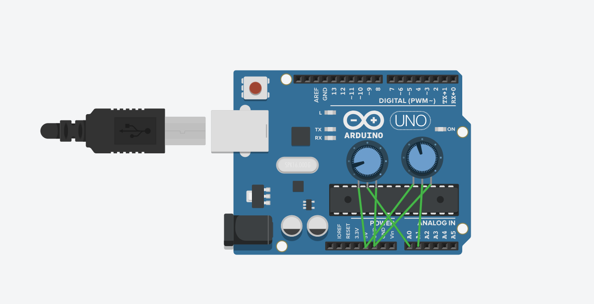

# BMP280 Emulator

This repository contains the library for the BMP280 Emulator project.

*Read this in other languages: [English](README.md), [Українська](README.ua.md).*

## Demo

https://www.tinkercad.com/things/bAngWSZNUG7-bmp280-emulator-playground?sharecode=GnD5F3vCIjBSxAsLHlOoxG4NRtstipNy1mo6nr-XVWQ



## Installation

To use this project, follow these steps:

1. Clone the repository to your local machine.
2. Include the `BMP280Emulator` library in your Arduino IDE.
3. Open the example sketch file `BMP280EmulatorExample.ino`.
4. Upload the sketch to your Arduino board.

## Hardware Setup

To simulate external temperature and pressure readings:

- Connect a potentiometer to analog pin A0 to emulate pressure.
- Connect another potentiometer to analog pin A1 to emulate temperature.

These potentiometers will act as variable resistors, allowing you to change the analog input values read by the Arduino, thereby simulating different temperature and pressure readings.

## Usage Example

After including the `BMP280Emulator` library, you can use it in your sketch as follows:

```arduino
#include <Wire.h>
#include "BMP280Emulator.h"

BMP280Emulator bmp280;

void setup() {
  Serial.begin(9600);
  bmp280.begin();
}

void loop() {
  bmp280.update();
  float temperature = bmp280.getMappedTemperature();
  float pressure = bmp280.getMappedPressure();

  Serial.print("Temperature: ");
  Serial.print(temperature);
  Serial.print(", Pressure: ");
  Serial.println(pressure);

  delay(1000);
}
```

This example initializes the BMP280 emulator and periodically reads and prints the temperature and pressure values.

## Contributing

Contributions to this project are welcome. To contribute:

1. Fork the repository.
2. Create a new branch for your feature (`git checkout -b feature/YourFeature`).
3. Commit your changes (`git commit -am 'Add some feature'`).
4. Push to the branch (`git push origin feature/YourFeature`).
5. Create a new Pull Request.

## License

This project is licensed under the MIT License - see the [LICENSE](LICENSE) file for details.
