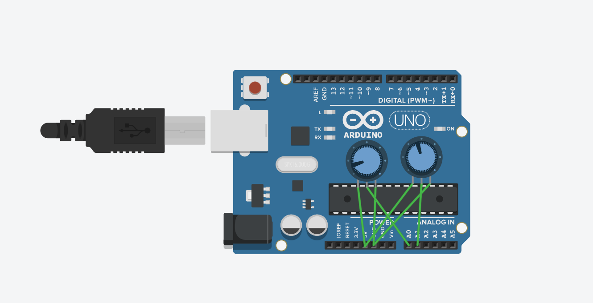

# Емулятор BMP280

Цей репозиторій містить бібліотеку для проекту Емулятора BMP280.

*Читайте це на інших мовах: [English](README.md), [Українська](README.ua.md).*

## Демонстрація

https://www.tinkercad.com/things/bAngWSZNUG7-bmp280-emulator-playground?sharecode=GnD5F3vCIjBSxAsLHlOoxG4NRtstipNy1mo6nr-XVWQ



## Інсталяція

Щоб використати цей проект, слідуйте таким крокам:

1. Клонуйте репозиторій на свій локальний комп'ютер.
2. Додайте бібліотеку `BMP280Emulator` у ваше Arduino IDE.
3. Відкрийте приклад скетчу `BMP280EmulatorExample.ino`.
4. Завантажте скетч на вашу плату Arduino.

## Налаштування апаратного забезпечення

Щоб симулювати зовнішні показники температури та тиску:

- Підключіть потенціометр до аналогового виводу A0 для імітації тиску.
- Підключіть інший потенціометр до аналогового виводу A1 для імітації температури.

Ці потенціометри будуть виступати як змінні резистори, дозволяючи вам змінювати аналогові вхідні значення, які читає Arduino, тим самим симулюючи різні показники температури та тиску.

## Приклад використання

Після додавання бібліотеки `BMP280Emulator`, ви можете використовувати її у своєму скетчі наступним чином:

```arduino
#include <Wire.h>
#include "BMP280Emulator.h"

BMP280Emulator bmp280;

void setup() {
  Serial.begin(9600);
  bmp280.begin();
}

void loop() {
  bmp280.update();
  float temperature = bmp280.getMappedTemperature();
  float pressure = bmp280.getMappedPressure();

  Serial.print("Температура: ");
  Serial.print(temperature);
  Serial.print(", Тиск: ");
  Serial.println(pressure);

  delay(1000);
}
```

Цей приклад ініціалізує емулятор BMP280 та періодично читає та виводить значення температури та тиску.

## Внесок

Внески у цей проект вітаються. Щоб зробити внесок:

1. Створіть форк репозиторію.
2. Створіть нову гілку для вашої функції (`git checkout -b feature/YourFeature`).
3. Здійсніть коміт ваших змін (`git commit -am 'Add some feature'`).
4. Відправте зміни у гілку (`git push origin feature/YourFeature`).
5. Створіть новий запит на злиття (Pull Request).

## Ліцензія

Цей проект ліцензовано за ліцензією MIT - деталі дивіться у файлі [LICENSE](LICENSE).